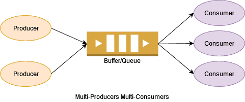

# poly-kitchen
My first assignment to learn polymorphism in the OOP using JAVA. 

```
├── docs
│   └── Task - Polimorfismo.pdf
├── README.md
└── src
    ├── Main.java
    └── vitty
        └── oop
            └── kitchen
                ├── Cake.java
                ├── Client.java
                ├── Cook.java
                ├── Dessert.java
                ├── Dish.java
                ├── IceCream.java
                ├── Ingredient.java
                ├── Pasta.java
                ├── Pizza.java
                └── QueueDishes.java
```

## Concurrency Programming
I've implemented a concurrency version using producerc-consumer paradigm.
- Client: Consumer
- Cook: Producer

My version uses a circular buffer, in this case, a buffer means a queue of ordered dishes by clients and prepared by cook.
<center>
    
</center>

## Output
```
    Patapizza will be ready in 200 minutes
    Giancarlo are eating Patapizza
    Setteveli will be ready in 200 minutes
    Luigi are eating Setteveli
    Tonno will be ready in 200 minutes
    Luigi are eating Tonno
    Chcolate will be ready in 200 minutes
    Luigi are eating Chcolate
```